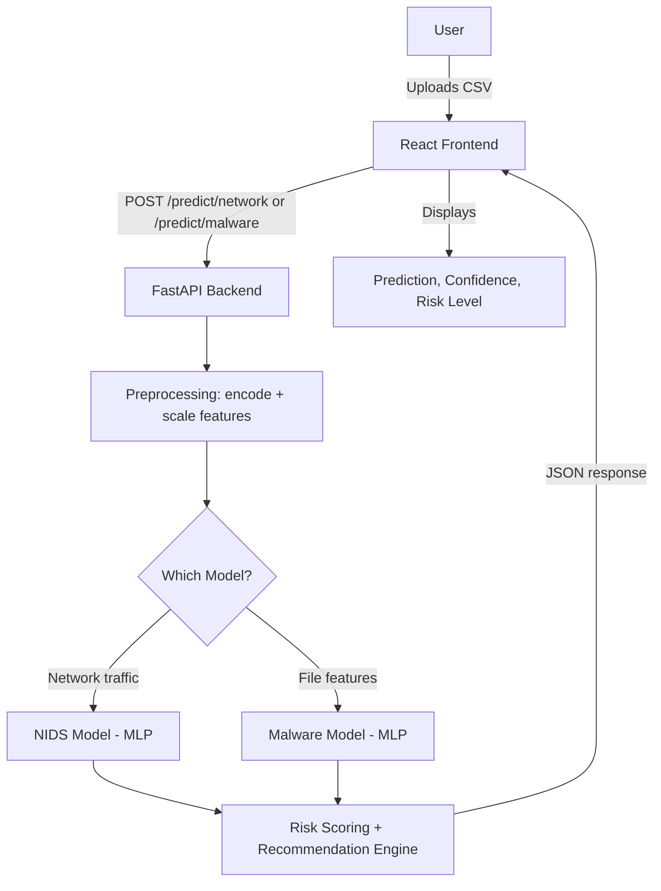

# 🛡️ Sentra — AI-Based Cyber Threat Detection Framework

An end-to-end machine learning platform that combines **Network Intrusion Detection** and **Malware Classification** into a single deployable web application. Built during my internship at DRDO to explore how machine learning can complement traditional, signature-based cybersecurity systems by learning to recognize malicious behavior directly from data.

**[Live Demo](#)** · **[Backend API](#)** · **[API Docs](#)**

---

## Table of Contents
- [Introduction](#introduction)
- [Why This Project](#why-this-project)
- [The Problem: Why Signature-Based Security Isn't Enough](#the-problem-why-signature-based-security-isnt-enough)
- [System Architecture](#system-architecture)
- [Module 1 — Network Intrusion Detection](#module-1--network-intrusion-detection)
- [Module 2 — Malware Detection](#module-2--malware-detection)
- [Machine Learning Pipeline](#machine-learning-pipeline)
- [Why Two Models? (MLP vs Random Forest)](#why-two-models-mlp-vs-random-forest)
- [Evaluation Metrics, Explained for Security](#evaluation-metrics-explained-for-security)
- [Backend](#backend)
- [Frontend](#frontend)
- [Deployment](#deployment)
- [Project Structure](#project-structure)
- [API Documentation](#api-documentation)
- [Installation](#installation)
- [Results](#results)
- [Known Limitations](#known-limitations)
- [Future Work](#future-work)
- [References](#references)
- [Author](#author)

---

## Introduction

Every organization — government, financial, healthcare, or cloud — moves enormous volumes of data across networks every second. Hidden inside that legitimate traffic are malicious activities: denial-of-service floods, reconnaissance scans, credential-guessing attempts, and malware trying to establish a foothold.

Traditional security tools — firewalls, signature-based IDS/IPS, antivirus — work by matching traffic or files against known patterns. This works well for *known* threats, but breaks down against attacks that are slightly modified, entirely new, or deliberately engineered to evade a fixed signature.

**Sentra** explores the alternative: instead of matching against a fixed rulebook, train models to learn what normal vs. malicious traffic and files statistically look like, and generalize from there. It integrates two independent ML pipelines — network intrusion detection and malware classification — behind a single FastAPI backend and React frontend, so predictions can be triggered in real time via a simple CSV upload rather than only inside a notebook.

## Why This Project

Most public ML-security projects stop at a Jupyter notebook: load a dataset, train a model, print an accuracy score, done. That's a reasonable way to learn the fundamentals, but it doesn't reflect how these systems actually get used.

I wanted to build the complete lifecycle instead — raw dataset → preprocessing → model training → benchmarking against a classical baseline → saved, reusable model artifacts → a REST API that serves predictions → a UI that a non-technical user could actually operate. The two modules were chosen deliberately: network intrusion detection defends the *perimeter* (traffic between machines), while malware detection defends the *endpoint* (files on a machine). Together they cover two of the most common attack surfaces in a real security stack.

## The Problem: Why Signature-Based Security Isn't Enough

A **firewall** filters traffic based on ports, IPs, and protocols — it has no concept of *behavior*. An **IDS/IPS** improves on this by matching traffic against known attack signatures, but a signature is fundamentally a statement of the form *"if this traffic looks exactly like pattern X, flag it."* Antivirus software applies the same logic to files, checking them against a database of known malware hashes or byte patterns.

The weakness is structural, not incidental: all of these approaches require the attack to already be *known and cataloged*. Two categories of threats routinely slip through:

- **Zero-day attacks** — techniques that have never been seen before, so no signature exists yet.
- **Polymorphic / evasive threats** — malware or traffic patterns deliberately mutated to avoid matching a known signature, while still carrying out the same malicious action.

Machine learning approaches this differently. Instead of memorizing exact patterns, a model trained on labeled examples of normal vs. malicious behavior learns the *statistical shape* of an attack — unusual connection counts, abnormal byte ratios, suspicious login failure patterns, or file characteristics that correlate with malicious intent — and can flag traffic or files that resemble known attack behavior even if the exact instance has never been seen before. This is the core motivation behind Sentra: use ML as a **complement** to signature-based tools, not a replacement, to catch what static rules miss.

## System Architecture



Both modules share the same underlying pattern: raw features in, a trained classifier in the middle, a risk-scored, human-readable verdict out. The backend loads all models, scalers, and label encoders once at startup (not per-request) for low-latency inference.

## Module 1 — Network Intrusion Detection

**What it does:** Classifies a network connection record as either normal traffic or one of several attack categories (e.g., DoS, probe/reconnaissance, unauthorized access attempts).

**Dataset — NSL-KDD:** A widely used benchmark dataset for intrusion detection research, itself a cleaned-up revision of the original KDD Cup 1999 dataset (which suffered from redundant records that skewed model evaluation). Each row is one network connection, described by 41 features — protocol type, service, connection duration, byte counts in each direction, failed login attempts, and dozens of traffic-rate statistics — plus a label identifying it as normal or a specific attack type.

**Why preprocessing matters:** Raw network logs mix numeric fields (bytes transferred, duration) with categorical text fields (protocol: `tcp`/`udp`/`icmp`, service: `http`/`ftp`/`ssh`, etc.). Neural networks only operate on numbers, so categorical fields are label/integer-encoded, and the target labels are similarly encoded into class indices. Because features live on wildly different scales (a duration of 0–100 seconds vs. byte counts in the hundreds of thousands), all inputs are passed through a `StandardScaler` — without this, large-magnitude features would dominate gradient updates purely due to scale, not actual predictive relevance, destabilizing training.

**Model:** A Multi-Layer Perceptron (`hidden_layer_sizes=(64, 32)`, ReLU activation, Adam optimizer, early stopping) — a small feedforward neural network capable of learning non-linear feature interactions that a linear model would miss.

## Module 2 — Malware Detection

**What it does:** Classifies an executable file as benign or malicious based on static features extracted from the file (not by running it) — attributes like file size, header structure, imported functions, and section characteristics that are known to statistically differ between legitimate software and malware.

**Pipeline:** Identical shape to the NIDS module — clean missing values, encode categorical fields, scale numeric features, split into train/test, train an MLP, benchmark against Random Forest. For this binary classification task, ROC-AUC is additionally computed, since it measures how well the model separates the two classes across every possible decision threshold, not just the one currently chosen.

## Machine Learning Pipeline

```
Raw Dataset
    │
Missing Value Handling — drop/impute incomplete records so the model never sees NaNs
    │
Categorical Encoding — text fields (protocol, service, etc.) → integers
    │
Label Encoding — target classes → integers
    │
Feature Scaling — StandardScaler normalizes every feature to comparable magnitude
    │
Train/Test Split (80/20, stratified) — held-out data the model never trains on
    │
Model Training — MLPClassifier (primary) + Random Forest (baseline)
    │
Evaluation — Accuracy, Precision, Recall, F1, Confusion Matrix, ROC-AUC
    │
Model Persistence — trained model, scaler, and label encoder saved as .pkl
    │
FastAPI Backend — loads artifacts once, serves predictions over REST
    │
React Frontend — CSV upload, results dashboard
```

The `stratify=y` split ensures every class (including rare attack types) keeps roughly the same proportion in both the training and test sets, so evaluation isn't accidentally skewed by a lucky or unlucky split.

## Why Two Models? (MLP vs Random Forest)

Random Forest is included deliberately, not as an afterthought — it remains one of the strongest, most robust algorithms on structured/tabular data of this kind, and it's the standard baseline any tabular ML result should be measured against. Training an MLP without a baseline makes it impossible to know whether the neural network is actually adding value, or whether a simpler, faster, more interpretable model would perform just as well (in several published NSL-KDD benchmarks, tree-based models are competitive with or better than deep architectures — a result this project's own evaluation should be read against, not assumed to contradict). Benchmarking both, side by side, on identical train/test splits turns "I trained a model" into "I trained a model and can defend why it's the right choice."

## Evaluation Metrics, Explained for Security

- **Accuracy** — the percentage of all predictions that were correct. Easy to read, but misleading on imbalanced datasets (see Limitations below).
- **Precision** — of everything the model flagged as an attack, what fraction actually was one. Low precision means excessive false alarms — a real operational cost for a security team.
- **Recall** — of all the actual attacks in the data, what fraction the model caught. Low recall means attacks are slipping through undetected, which is typically the more expensive failure mode in security.
- **F1 / Weighted F1** — the balance between precision and recall, weighted across all classes to account for how imbalanced the class distribution is (a handful of attack types have very few samples).
- **Confusion Matrix** — a full breakdown of exactly which classes get confused with which, which is far more informative than a single accuracy number when some attack types are rare.
- **ROC-AUC** (malware module) — measures how well the model separates benign from malicious across *every* possible decision threshold, not just the default one, which is useful when you may want to tune sensitivity later.

## Backend

Built with **FastAPI**, chosen for its async support, automatic OpenAPI docs, and low overhead for a prediction-serving API. On startup, the backend loads all six model artifacts (two models, two scalers, two label encoders) into memory once via a lifespan context manager, so individual prediction requests don't pay the cost of disk I/O. Each `/predict/*` endpoint accepts a CSV upload, runs it through the same preprocessing logic used in training, and returns per-row predictions with confidence scores, a risk-level classification (Low/Medium/High/Critical), and a short recommendation string — plus an overall "highest threat in this batch" summary so a user scanning many rows can immediately see the worst finding.

## Frontend

Built with **React** (Vite + TypeScript). Handles CSV upload, calls the backend's REST endpoints, and renders predictions, confidence scores, and risk levels in a readable dashboard rather than raw JSON — the goal being that someone without ML background could upload a file and understand the output.

## Deployment

- **Frontend → Vercel** — zero-config static hosting for the Vite build, automatic deploys on push.
- **Backend → Render** — free-tier container hosting for the FastAPI service; the main tradeoff is cold-start latency after idle periods, which is acceptable for a demo but worth noting for anyone expecting production-grade responsiveness.

## Project Structure

```
Sentra/
├── backend/
│   ├── app.py                  # FastAPI routes: /predict/network, /predict/malware
│   ├── utils.py                # Preprocessing, categorical mappings, risk-level logic
│   ├── models/                 # Saved model, scaler, and label encoder .pkl files
│   ├── generate_sample_csv.py  # Utility to produce a valid sample input CSV
│   ├── sample_nids.csv         # Example input for manual testing
│   └── requirements.txt
├── frontend/
│   ├── src/
│   │   ├── components/         # UI components (upload, results dashboard, etc.)
│   │   ├── routes/             # Page-level routing
│   │   └── services/           # API client calls to the backend
│   └── package.json
├── DRDO_PROJECT.ipynb           # Original research/training notebook
└── README.md
```

## API Documentation

**`POST /predict/network`**
Accepts a CSV of network connection features (matching NSL-KDD's 41-feature schema).

Response:
```json
{
  "prediction": "nmap",
  "confidence": 0.999,
  "risk_level": "High",
  "recommendation": "Investigate source IP for reconnaissance activity.",
  "is_batch": true,
  "total_samples": 10,
  "results": [
    { "row_index": 0, "prediction": "nmap", "confidence": 0.999, "risk_level": "High", "recommendation": "..." }
  ]
}
```

**`POST /predict/malware`**
Accepts a CSV of static file features. Returns the same response shape, with `prediction` as `benign`/`malicious`.

Full interactive documentation (via FastAPI's auto-generated Swagger UI) is available at `/docs` on the running backend.

## Installation

```bash
# Backend
cd backend
pip install -r requirements.txt
uvicorn app:app --reload

# Frontend (separate terminal)
cd frontend
npm install
npm run dev
```

The backend expects the six `.pkl` artifacts to already exist in `backend/models/` — these are produced by running `DRDO_PROJECT.ipynb` end to end, or can be included directly in the repo (as they currently are) so the API works out of the box without retraining.

## Results

| Module | Model | Accuracy | Weighted F1 |
|---|---|---|---|
| Network Intrusion | MLP | ~98% | ~0.98 |
| Network Intrusion | Random Forest | ~99.6% | ~0.996 |
| Malware Classification | MLP | ~97.5% | ~0.975 |
| Malware Classification | Random Forest | ~96% | ~0.96 |

*(Exact figures depend on the training run — see the notebook's saved outputs for precise values.)*

## Known Limitations

Being upfront about these matters more than hiding them:

- **NSL-KDD is a legacy dataset.** It reflects network traffic patterns from the late 1990s/2000s. It's an appropriate, well-understood benchmark for learning intrusion detection fundamentals, but it does not represent modern threats like encrypted C2 traffic, API abuse, or cloud lateral movement. This project should be read as a demonstration of the ML pipeline and methodology, not as a production-ready detector for current threats.
- **High accuracy warrants scrutiny, not just reporting.** Near-99% scores on NSL-KDD are a known pattern in published research, partly attributable to record redundancy in the original KDD data (NSL-KDD was created specifically to reduce, though not eliminate, this issue) and partly to some attack classes being easy to separate. Results should be interpreted alongside the confusion matrix, not the headline accuracy number alone.
- **No adversarial evaluation yet.** The current models are not tested against inputs deliberately crafted to evade detection — a meaningful gap for anything described as a "threat detection" system, and the top item in Future Work below.
- **Malware feature schema assumes clean input.** Unknown/out-of-range categorical values in uploaded CSVs are currently mapped to defaults rather than rejected — reasonable for demo robustness, but worth hardening before treating this as production-grade.

## Future Work

- **Adversarial robustness testing** — evaluate the models against perturbed/adversarial inputs designed to evade detection, and report the drop in performance. This is the single highest-value addition, since a threat detector's resilience to evasion is arguably more important than its baseline accuracy.
- **Real-time packet capture** (via Scapy) — move from static CSV upload to live traffic ingestion, closing the gap between "demo" and "deployable tool."
- **Modern dataset integration** — supplement or replace NSL-KDD with a more current dataset (e.g., CICIDS2017/2018) to better reflect present-day traffic patterns.
- **Streaming architecture** — introduce a message queue (e.g., Kafka) so the system can score connections continuously rather than in discrete batch uploads.
- **Containerized deployment** — Docker Compose for backend + frontend + reverse proxy, so the whole stack can be spun up with one command instead of two separate hosting providers.

## References

- Tavallaee, M., et al. — *"A Detailed Analysis of the NSL-KDD Dataset"* (IEEE CISDA 2009)
- [scikit-learn documentation](https://scikit-learn.org/stable/)
- [FastAPI documentation](https://fastapi.tiangolo.com/)
- [Render documentation](https://render.com/docs)
- [Vercel documentation](https://vercel.com/docs)

## Author

**Aditya Sagar**
B.Tech, Computer Science Engineering
Machine Learning · Cybersecurity · AI
Developed during internship at DRDO
